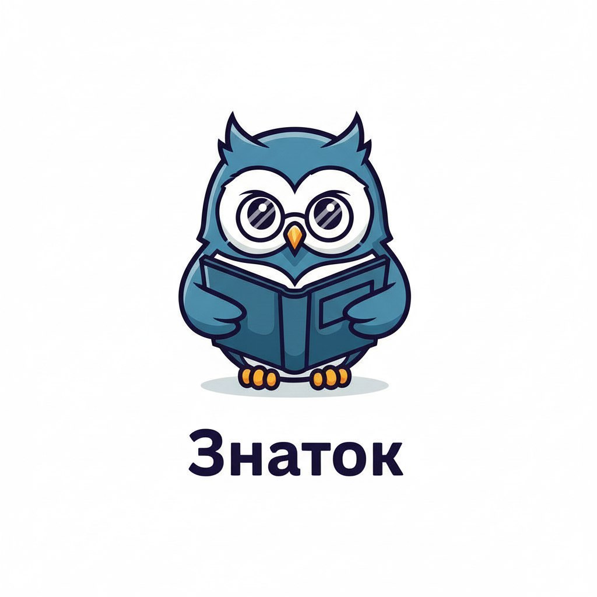

# 🤖 Znatok AI Assistant



**Znatok** — корпоративный AI-ассистент на основе RAG (Retrieval-Augmented Generation), который помогает сотрудникам находить точные ответы в внутренних документах компании: политиках, регламентах, инструкциях и справочниках.

Поддерживает интеграцию с **Telegram** и **Битрикс24**, настраивается под любого LLM-провайдера и легко развёртывается в Docker.

---

## 📦 Содержание

- [Основные возможности](#основные-возможности)
- [Бизнес-ценность](#бизнес-ценность)
- [Системные требования](#системные-требования)
- [Быстрый старт](#быстрый-старт)
- [Настройка](#настройка)
  - [LLM-провайдеры](#llm-провайдеры)
  - [Интеграции](#интеграции)
- [API](#api)
- [Архитектура](#архитектура)
- [Лицензия](#лицензия)

---

## Основные возможности

- 🔍 **Семантический поиск** по загруженным документам (PDF, DOCX, TXT)
- 💬 **Чат-интерфейс** с контекстными ответами на естественном языке
- 📁 **Управление документами**: автоматизированный обмен с популярными Базами знаний:
  - Битрикс24
  - Confluence
- 🤖 **Интеграция с мессенджерами**:
  - Telegram
  - Битрикс24 (через вебхуки)
- ⚙️ **Гибкая настройка** LLM-провайдера:
  - GigaChat (Сбер)
  - Yandex GPT
  - Mistral AI
- 🌓 **Тёмная/светлая тема**, адаптивный интерфейс
- 🔒 **Изолированная среда**: данные не покидают вашу инфраструктуру

---

## Бизнес-ценность

- **Снижение времени** на поиск информации в регламентах и инструкциях
- **Снижение нагрузки** на HR, IT, юристов и других специалистов поддержки
- **Ускорение онбординга** новых сотрудников
- **Единый источник правды** — всегда актуальные и проверенные данные
- **Прозрачность** — каждый ответ содержит ссылку на источник

---

## Системные требования

| Компонент       | Требование |
|------------------|-----------|
| ОС               | Linux, macOS, Windows (через WSL/Docker) |
| Docker           | ≥ 20.10 |
| Docker Compose   | ≥ 2.0 |
| RAM              | ≥ 4 ГБ (рекомендуется 8 ГБ) |
| Свободное место  | ≥ 2 ГБ |
| Сетевой доступ   | к выбранному LLM-провайдеру и (опционально) Telegram API |

> 💡 **Важно**: эмбеддинги генерируются локально на CPU. GPU не требуется.

---

## Быстрый старт

1. **Клонируйте репозиторий**
   ```bash
   git clone https://github.com/ваш-логин/znatok.git
   cd znatok
   ```

2. **Создайте `.env` файл**
   ```env
   APP_SECRET_KEY=ваш_секрет
   QDRANT_HOST=qdrant
   QDRANT_PORT=6333
   QDRANT_COLLECTION=znatok_chunks
   ALLOWED_ORIGINS=http://localhost:8080
   BASE_URL=http://localhost:8000
   ```

3. **Запустите сервисы**
   ```bash
   docker-compose up --build -d
   ```

4. **Откройте интерфейс**
   ```
   http://localhost:8080
   ```

5. **Настройте LLM-провайдер** (раздел «Настройки») и **загрузите документы**

Готово! 🎉

---

## Настройка

### LLM-провайдеры

Поддерживаемые провайдеры:
- **GigaChat** — используйте `Authorization Key` из [Sber Developers Studio](https://developers.sber.ru/studio)
- **Yandex GPT** — получите `API Key` в [Yandex Cloud Console](https://console.cloud.yandex.ru)
- **Mistral AI** — токен из [Mistral Console](https://console.mistral.ai)

Все настройки сохраняются в `/app/data/settings.json` внутри контейнера.

### Интеграции

#### Telegram
1. Создайте бота через [@BotFather](https://t.me/BotFather)
2. Скопируйте токен и вставьте в раздел **Интеграции → Telegram**
3. Сохраните — бот запустится автоматически

#### Битрикс24
1. В CRM создайте приложение с правами на события мессенджера
2. Укажите вебхук: `http://ваш-домен/bitrix24/webhook`
3. Скопируйте `CLIENT_SECRET` и вставьте в интерфейс Znatok

---

## API

| Эндпоинт | Метод | Описание |
|---------|-------|--------|
| `/api/ask` | `POST` | Отправить вопрос и получить ответ |
| `/api/upload` | `POST` | Загрузить документы (multipart/form-data) |
| `/api/documents` | `GET` | Список загруженных документов |
| `/api/documents/{filename}` | `DELETE` | Удалить документ |
| `/api/settings` | `GET/POST` | Управление настройками LLM |
| `/api/integrations` | `GET/POST` | Управление интеграциями |
| `/api/health` | `GET` | Проверка работоспособности |

Пример запроса:
```json
POST /api/ask
{
  "question": "Как оформить отпуск?",
  "user_department": "all"
}
```

---

## Архитектура

```
┌─────────────┐     ┌─────────────┐     ┌──────────────┐
│  Frontend   │────▶│   FastAPI   │────▶│   Qdrant     │
│ (React-like │     │  (Backend)  │     │ (Vector DB)  │
│   static)   │◀────│             │     └──────────────┘
└─────────────┘     └──────┬──────┘
                           │
         ┌─────────────────▼─────────────────┐
         │ LLM Providers (GigaChat, Yandex…) │
         └───────────────────────────────────┘
         ┌───────────────────────────────────┐
         │ Messengers (Telegram, Bitrix24)   │
         └───────────────────────────────────┘
```

Технологии:
- **Frontend**: HTML, CSS, Vanilla JS
- **Backend**: FastAPI, Python 3.11
- **Embeddings**: `sentence-transformers/paraphrase-multilingual-MiniLM-L12-v2`
- **Векторная БД**: Qdrant
- **LLM**: подключение через HTTP API

---

## Лицензия

Проект распространяется под лицензией MIT. Подробнее — см. файл [LICENSE](LICENSE).
